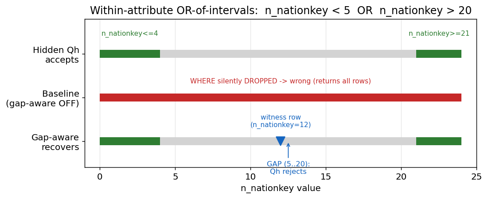
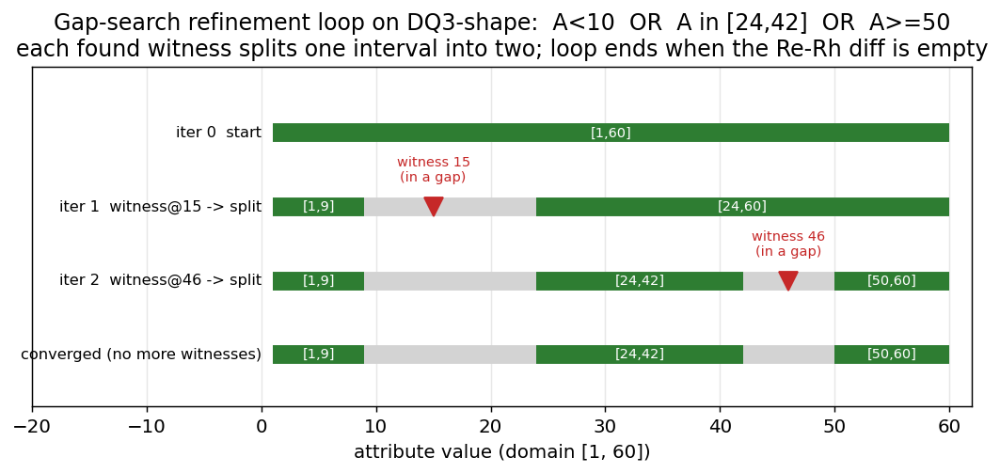
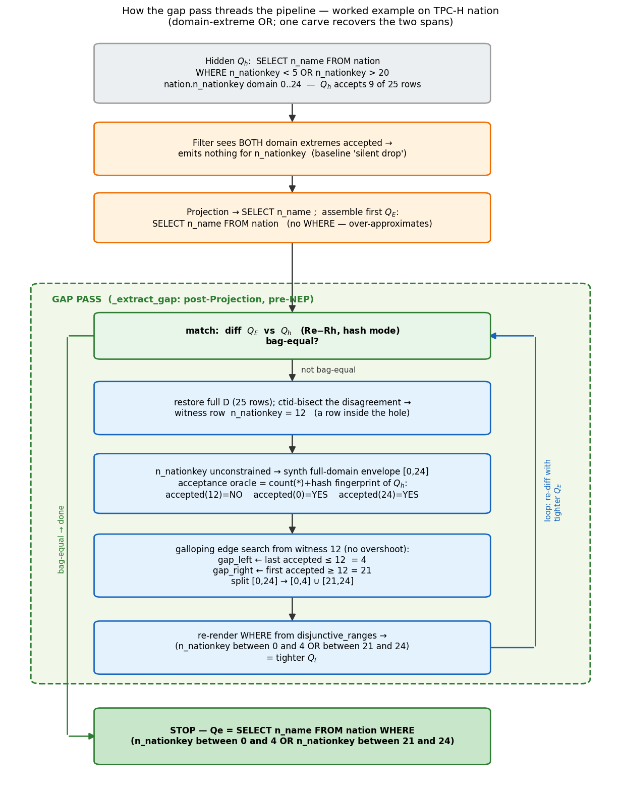
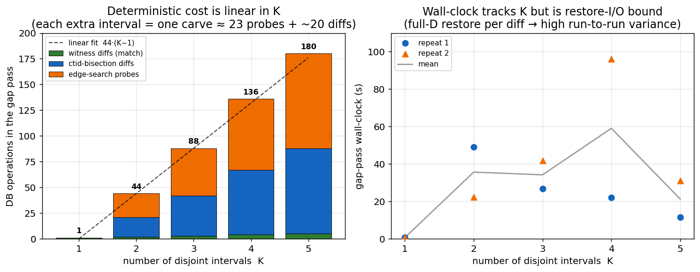
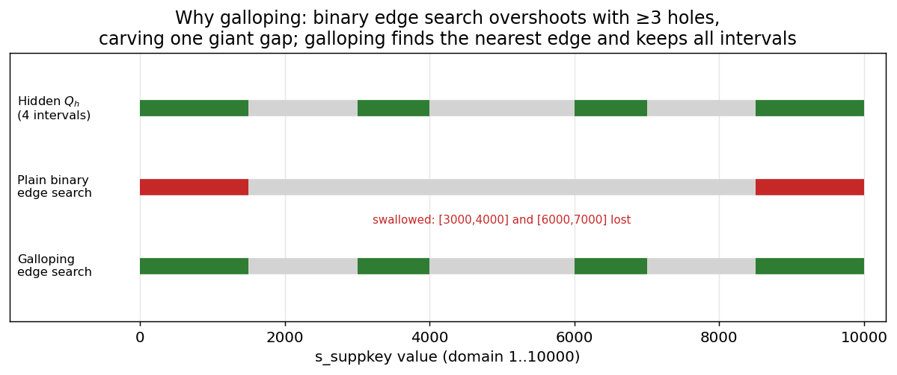
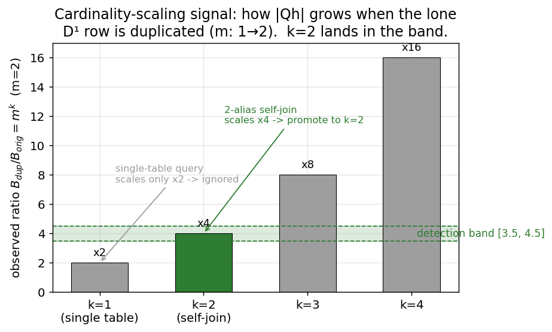
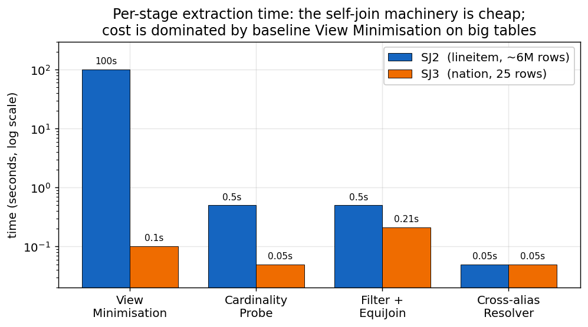

# Extending Hidden-Query Extraction in Xpose: Gap-Aware Disjunctions and Self-Joins

> A consolidated technical thesis
> Topic: Black-box SQL reconstruction for two constructs the baseline framework could not handle —
> within-attribute OR-of-intervals (**gap-aware**) and multi-instance **self-joins**.
> Style: plain language, with theory, proofs, worked examples, diagrams, plots, pseudocode, and limitations.

This single document replaces five earlier working notes
(`GAP_AWARE_HANDOFF.md`, `GAP_AWARE_V2_REPORT.md`,
`SELF_JOIN_HANDOFF.md`, `SELF_JOIN_REPORT.md`, `SELF_JOIN_THESIS_REPORT.md`).
Every claim here has been checked against the live source tree, so the
descriptions match the code as it actually runs.

---

## Table of contents

**Part I — Foundations**
1. What Xpose does, in one page
2. The vocabulary you need (Pop oracle, D¹, ctid, NEP, Comparator)
3. The two blind spots this work removes

**Part II — Gap-Aware Disjunction Extraction**
4. The problem: a single column with "holes"
5. Theory: the post-Projection Re − Rh witness oracle
6. Where it runs, and the two new components
7. Algorithms (pseudocode)
8. Why it is correct (proofs in plain words)
9. Worked example: `n_nationkey < 5 OR n_nationkey > 20`
10. Diagrams
11. Queries newly extractable
12. Limitations

**Part III — Self-Join / Multi-Instance Extraction**
13. The problem: the same table twice
14. Theory: the multiplicity signal and the scaling law
15. The architecture: Cardinality Probe + Cross-Alias Resolver
16. Algorithms (pseudocode)
17. Why it is correct (proofs in plain words)
18. Worked example: SJ3 cross-column self-join
19. The Postgres MVCC trap and how it is handled
20. Diagrams
21. Queries newly extractable
22. Limitations

**Part IV — Integration and Outlook**
23. Where both features sit in the real pipeline
24. Combined results
25. Combined limitations and future work
26. Conclusion
27. Glossary
28. Code map (files and key functions)

---

# Part I — Foundations

## 1. What Xpose does, in one page

Xpose (an UNMASQUE-style framework) is a **black-box SQL reverse-engineering**
tool. You hand it:

- a **hidden query** `Qh` — you cannot read its text, but you *can* run it; and
- a **database** `D` with the same tables `Qh` uses.

Xpose figures out the SQL of `Qh` by **changing the database and watching what
happens to `Qh`'s output**. It never parses `Qh`; it only executes it. The work
is split into stages, each of which recovers one piece of the query: the FROM
tables, the join graph, the WHERE constants, the inequalities, the SELECT
columns, GROUP BY, ORDER BY, LIMIT, and so on.

The single most important trick is **shrinking the database first**. A stage
called the *View Minimizer* peels rows away from every table until only **one
row per table** survives while `Qh` still returns something. That tiny database
is called **D¹**. On a one-row database, every "does this matter?" question
becomes cheap: mutate one cell, run `Qh`, see if the answer changes, undo.

## 2. The vocabulary you need

| Term | Plain meaning |
|---|---|
| **`Qh`** | The hidden query. Executable, but opaque — Xpose treats it as a sealed box. |
| **`Qe`** | The query Xpose has reconstructed so far. |
| **`D`** | The full original database (lives in the `user_schema`; never modified by either feature). |
| **`D¹`** | The minimized one-row-per-table working copy (lives in the working `schema`). |
| **Pop oracle** | A yes/no question: *"does `Qh` return a non-empty, not-all-NULL result on the current database?"* In code this is `app.isQ_result_nonEmpty_nullfree(app.doJob(query))`. The Filter stage asks it through `checkAttribValueEffect(query, value, [(tab,attr)])`, which UPDATEs a cell to `value`, runs `Qh`, reverts, and returns the yes/no. |
| **ctid** | Postgres's physical row address `(page, slot)`. Stages bisect a table by ctid ranges to zoom in on a specific row. |
| **Comparator** | A helper that checks whether two queries return the *same bag of rows* by materializing `(Re EXCEPT ALL Rh)` and `(Rh EXCEPT ALL Re)` and counting. The schema rule: it builds `r_h LIKE r_e`, so the two row-sets must have **identical columns** for the diff to mean anything. |
| **NEP** | "Not-Equal Predicate" — an existing feature that finds `A <> v` constants. Its reusable idea is: *use a row-set diff to prove a difference exists, then ctid-bisect down to the single row that causes it.* Gap-aware borrows exactly that idea. |
| **Predicate tuple** | Filter records each WHERE condition as a 5-tuple `(tab, attr, op, lb, ub)`, with `op` one of `'='`, `'<='`, `'>='`, `'range'`, `'equal'`, `'LIKE'`. |

## 3. The two blind spots this work removes

Baseline Xpose quietly assumes two things that are not always true:

1. **"Each column's filter is one solid range."** It assumes a WHERE condition on
   a column is a single interval like `A BETWEEN 5 AND 15`. If the real condition
   is a column with a **hole** in it — e.g. `A < 5 OR A > 20`, which is two
   ranges with a gap — the binary search either merges the gap or drops the
   condition entirely. **Part II (gap-aware)** fixes this.

2. **"Each table appears in FROM at most once."** It assumes no table is joined
   to itself. A **self-join** like `FROM lineitem l1, lineitem l2` breaks this:
   the minimizer collapses the table to one row, and the reconstructed query
   ends up with one copy of the table instead of two. **Part III (self-join)**
   fixes this.

The constructs this work adds, relative to the baseline:

| Construct | Baseline | This work |
|---|---|---|
| within-attribute OR of numeric ranges (`A∈[10,20] ∨ A∈[30,40]`) | merged into one fat interval → wrong | recovered as OR-of-BETWEEN |
| domain-extreme OR (`A<x OR A>y`) | WHERE silently dropped → returns everything | recovered |
| pure-equality self-join, same or cross column | collapsed to one table copy → bag-inequivalent | recovered, bag-equivalent |
| self-join with a cross-alias inequality (`l1.x < l2.x`) | **crashes** (`ERROR_002`) | **limitation (not extracted)** — the crash is removed and extraction reaches Projection, but the `<` between the two copies is not reconstructed (§22) |

The cross-alias-inequality self-join is treated throughout as a **limitation**, not
a partial result: the contribution there is only that the pipeline no longer
crashes. The within-attribute OR has its own bounds (multi-interval edge search
and narrow swallowed intervals), stated precisely in §12.

---

# Part II — Gap-Aware Disjunction Extraction

## 4. The problem: a single column with "holes"

Filter discovers a numeric WHERE constant by **binary search on D¹**. Starting
from a value the query accepts, it pushes outward — left and right — asking the
Pop oracle at each step, until it pins down the left and right edges of an
interval. This is the function `get_filter_value` ([filter.py:261](mysite/unmasque/src/core/filter.py#L261)).

That works perfectly when the hidden condition really is one interval. It
**fails in two ways** when the condition is a *union of disjoint intervals on the
same column* — for example `A ∈ [10,20] OR A ∈ [30,40]`:

- **Failure mode 1 — over-approximation.** Start from a value inside the first
  interval, say `A = 15`. As the search pushes right, its midpoints land
  *inside the second interval* (e.g. `35` is also accepted). The search never
  notices the gap `(20, 30)` and reports one fat interval `[10, 40]`. The hole is
  silently filled in.

- **Failure mode 2 — silent drop.** When the condition reaches *both ends* of the
  domain, e.g. `A < 5 OR A > 20`, then both the smallest possible value and the
  largest possible value are accepted. In `handle_point_filter`, the baseline's
  branch cascade (`not-min and not-max`, `min and not-max`, `not-min and max`)
  has **no branch** for "both ends accepted," so it falls through and emits
  **nothing** — the whole condition disappears from the WHERE clause.

> **Verified detail.** Filter itself is left unchanged — it still emits *nothing*
> for the both-ends case (that is the baseline behavior). The recovery happens
> later: the relocated post-Projection gap pass notices that the reconstructed
> `Q_E` (with no constraint on `A`) over-approximates `Qh`, treats `A` as an
> unconstrained numeric attribute, **synthesizes a full-domain envelope**
> ([`_unconstrained_numeric_attrs`](mysite/unmasque/src/pipeline/fragments/GapPipeLine.py)/`_full_domain`
> in [GapPipeLine.py](mysite/unmasque/src/pipeline/fragments/GapPipeLine.py)) and
> carves the holes. So with `gap_aware = yes` the both-ends case is handled; the
> old in-Filter `_gap_aware_enabled()` branch was removed in the relocation.

Figure 1 shows both modes for a concrete column.



*Figure 1. The canonical case on the TPC-H `nation` table (key domain 0..24).
The hidden query accepts the two green spans. The baseline drops the WHERE and
wrongly returns everything (red). Gap-aware finds a witness row inside the gap
(blue marker at 12) and recovers the two spans.*

**Why we cannot just store two range tuples.** A tempting fix is to put two
`range` tuples on the same `(tab, attr)` into `filter_predicates`. But downstream
the AOA stage *intersects* multiple ranges on one column — `(max of lows, min of
highs)` — which turns `[(0,4),(21,24)]` into `(21,4)` and renders the nonsense
`between 21 and 4`. So a disjunction **must not** be expressed as two predicate
tuples. Gap-aware instead emits **one enveloping `range` tuple** (so AOA/EquiJoin
stay happy) and records the real OR-of-intervals in a **side channel** dict,
`disjunctive_ranges[(tab,attr)]`. This is written by the gap pass itself
([`GapPipeLine._apply_disjunctions`](mysite/unmasque/src/pipeline/fragments/GapPipeLine.py#L382)
→ [`QueryStringGenerator.regenerate_with_disjunctions`](mysite/unmasque/src/util/QueryStringGenerator.py#L437))
and consumed only by the query-string renderer
([`__generate_arithmetic_pure_conjunctions`](mysite/unmasque/src/util/QueryStringGenerator.py#L627)),
which expands it to `(A between .. OR A between ..)`. It lives in
`QueryStringGenerator`, not in Filter, and is populated *post-Projection* in the
gap pass ([ExtractionPipeLine.py:249](mysite/unmasque/src/pipeline/ExtractionPipeLine.py#L249)).

## 5. Theory: the post-Projection Re − Rh witness oracle

> **Design update (this revision).** Gap extraction was moved out of the Filter
> stage and reimplemented as a **NEP-style diff pass that runs after
> Projection** — exactly where NEP sits. The witness idea is unchanged; what
> changed is *what we diff against*, and that single change removes the old
> projection limitation. The earlier in-Filter machinery (`gap_witness.py`,
> `_refine_with_gap_search` and its three-tier fallback chain) has been deleted.

The clean idea for finding a gap is:

> Let **Q_E** be the query Xpose has reconstructed so far — its FROM, joins, the
> WHERE with `A`'s over-approximating envelope `A BETWEEN lo AND hi`, and
> crucially its **projection**, which the Projection stage already recovered to
> match `Qh` column-for-column. Let **Re** = rows of `Q_E` and **Rh** = rows of
> `Qh`. Any row in **Re − Rh** is a **gap witness**: `Q_E` (whose envelope fills
> the hole) accepts it, but `Qh` rejects it — so its `A`-value sits in a hole of
> `A`'s real condition, and we find the hole's edges by binary search from there.

**Why this beats the old design.** The in-Filter version ran *before* the
projection was known, so it had to fabricate a comparison query from `Qh`'s raw
result header — which broke the instant `Qh` projected an expression or
aggregate. Diffing the **reconstructed `Q_E`** removes that entirely: the
comparator builds `r_h` as a table `LIKE r_e` and inserts `Qh`'s rows
positionally ([Comparator](mysite/unmasque/src/pipeline/abstract/Comparator.py)),
so the diff is well-defined for **bare-column, scalar-expression, and aggregate
(count/sum/min/max)** projections alike. This is the same property that makes
NEP projection-agnostic.

Four practical pieces:

**(a) Full D, by reuse.** The diff needs many rows. At NEP's pipeline position
the working schema holds the one-row D¹, but the comparator's restore loop refills
each core table to full D from `user_schema` as a *side effect* of `match()`. So
the gap pass gets full D for free by reusing the NEP comparator
([`GapMinimizer.match`](mysite/unmasque/src/core/gap_minimizer.py)) — no bespoke
table-swap.

**(b) Read `A` even when it is not projected.** The witness is found as a
**base-table row**, not a result row: `GapMinimizer` ctid-bisects the offending
table to the single row that still causes the diff, then we read `A` straight off
it ([`_read_witness_attr`](mysite/unmasque/src/pipeline/fragments/GapPipeLine.py)).
`A` never needs to appear in `Qh`'s SELECT.

**(c) A single, always-on projection-agnostic acceptance oracle.** To find the
gap's edges we search `A`, asking "does value `e` make this row contribute to
`Qh`?" There is **one** regime
([`_make_acceptance_oracle`](mysite/unmasque/src/pipeline/fragments/GapPipeLine.py)):
set the witness cell to `e` ([`_raw_update`](mysite/unmasque/src/pipeline/fragments/GapPipeLine.py),
no revert — the next iteration restores full D) and compare a **result
fingerprint** of `Qh` — `count(*) + sum(hashtext(row::text))`
([`_signature_at`](mysite/unmasque/src/pipeline/fragments/GapPipeLine.py)) — against
the fingerprint at the rejected witness `v`; any movement means the row now
contributes. We do **not** use a plain Pop (non-empty) check here: the working
executable reports a single result row valued `0` as *empty*, so Pop cannot tell
"0 rows" from "1 row valued 0" — which fools it for a `count(*)` aggregate *and*
for a scalar expression that happens to be `0` at the probe point (e.g.
`2*n_nationkey` at `n_nationkey=0`). The wrapped `count(*)` reads the true
output-row count, so the fingerprint distinguishes all of these uniformly.
(Pop remains in use elsewhere — Filter's `checkAttribValueEffect`, and the
self-join Cardinality Probe — just not as the gap oracle.)

**(d) The false-witness pre-check, retained.** The diff finds a row rejected
by `Qh`; the rejection could be a hole in **some other column**. So before
splitting we require, *through the same fingerprint oracle*, that setting `A` to
the witness value is rejected while the interval endpoints are accepted
([`_find_one_gap`](mysite/unmasque/src/pipeline/fragments/GapPipeLine.py): the
`accepted(v)` / `accepted(lb)` / `accepted(ub)` gates). A column that does not
constrain `Qh` self-rejects (its endpoints come back accepted-everywhere or
rejected-everywhere), so no spurious split is emitted.

## 6. Where it runs, and the two new components

Gap-aware is still gated by **`gap_aware = yes`** ([config.ini](mysite/config.ini)
`[feature]`, runtime `config.detect_gap_aware`). It is no longer a three-tier
fallback inside Filter; it is **one NEP-style pass** in a new fragment,
[GapPipeLine](mysite/unmasque/src/pipeline/fragments/GapPipeLine.py), invoked from
[ExtractionPipeLine](mysite/unmasque/src/pipeline/ExtractionPipeLine.py)
immediately after `formulate_query_string` and **before** `_extract_NEP` — so a
wide continuous gap is carved as one OR-of-BETWEEN rather than NEP emitting a
flurry of single `<>` points.

Two components:

1. **`GapMinimizer`** ([gap_minimizer.py](mysite/unmasque/src/core/gap_minimizer.py))
   — a thin `NepMinimizer` subclass. It reuses NEP's restore-full-D + EXCEPT-ALL
   diff + ctid bisection wholesale and only overrides the per-half test to be
   **projection-agnostic**: a ctid half retains a witness iff `Q_E` and `Qh`
   genuinely *disagree* over it **and** `Q_E` produced rows there. The base
   `NepMinimizer` decides via result-*cardinality* heuristics, which are blind to
   aggregate-value differences (`count(*)` always returns one row); the
   `r_e`-non-empty guard is equally load-bearing, because the comparator runs in
   hash mode where an empty `r_e` hashes to NULL and is misreported as a mismatch.

2. **`GapPipeLine._extract_gap`** — the loop: diff `Q_E` vs `Qh`; if bag-equal,
   stop (no gaps); else minimize to a witness, attribute the hole to a numeric/
   date column, bisect outward for the edges, split the interval, re-render `Q_E`
   tighter, and repeat (bounded by `GAP_CUTOFF`). Two candidate sources per
   table: attributes already carrying an enveloping `range` predicate from Filter
   (`_range_envelopes` — the hole-in-interval case) and, failing those,
   unconstrained numeric/date attributes whose two domain extremes are both
   accepted (`_unconstrained_numeric_attrs` + `_full_domain` — the
   both-domain-extremes case that Filter now drops entirely).

The render path is unchanged and reused: discovered intervals go into the
`disjunctive_ranges` side channel together with an envelope `range` carrier
(synthesized for the both-ends case), and
[`QueryStringGenerator.regenerate_with_disjunctions`](mysite/unmasque/src/util/QueryStringGenerator.py)
re-derives the WHERE so `__generate_arithmetic_pure_conjunctions` swaps the
envelope for `(A BETWEEN .. OR A BETWEEN ..)`.

## 7. Algorithms (pseudocode)

All names below are the real functions in
[GapPipeLine.py](mysite/unmasque/src/pipeline/fragments/GapPipeLine.py) and
[gap_minimizer.py](mysite/unmasque/src/core/gap_minimizer.py).

**Algorithm G1 — the pass** (`_extract_gap`)
```
INPUT:  hidden Qh, current extracted Q_E (eq), core relations
OUTPUT: eq, possibly rewritten with OR-of-BETWEEN disjunctions

if not config.detect_gap_aware:  return eq
m = GapMinimizer(core_relations)             # reuses NEP comparator + ctid bisection
intervals = {} ; carriers = {}
repeat up to GAP_CUTOFF:
    eq = render(Q_E)
    matched = m.match(Qh, eq)                 # restores full D, EXCEPT-ALL diff
    if matched is None or matched: break      # malformed, or already bag-equal -> done
    progress = false
    for T in core_relations:
        if not m.doJob((Qh, eq, T)): continue # ctid-bisect T to 1 witness row
        if CARVE(T, intervals, carriers):     # Algorithm G2
            progress = true ; eq = APPLY(intervals, carriers)   # re-render tighter Q_E
    if not progress: break
return APPLY(intervals, carriers)
```

**Algorithm G2 — carve one gap on the witness row** (`_carve_gaps_for_table` + `_find_one_gap`)
```
CARVE(T):
  # 1) hole-in-interval: attrs Filter gave an enveloping 'range' carrier
  for (A,[lo,hi]) in range_envelopes(T):     if FIND_GAP(T,A,lo,hi,synth=false): return true
  # 2) both-domain-extremes: unconstrained numeric/date attrs, env = table [min,max]
  for A in unconstrained_numeric_attrs(T):
      [lo,hi] = full_domain(T,A)
      if FIND_GAP(T,A,lo,hi,synth=true): return true
  return false

FIND_GAP(T,A,lo,hi,synth):
  cur = intervals[(T,A)] or [(lo,hi)]
  v   = read A from the (1-row) witness
  (lb,ub) = the sub-interval of cur containing v;        if none: return false
  accepted = ORACLE(T,A,v)                                # Algorithm G3
  if accepted(v):                          return false   # false witness: v not a hole on A
  if not (accepted(lb) and accepted(ub)):  return false   # endpoints must be accepted
  gap_left  = gallop_last_sat (lb, v, accepted)           # largest accepted <= v (nearest edge)
  gap_right = gallop_first_sat(v, ub, accepted)           # smallest accepted >= v (nearest edge)
  if not (gap_left < gap_right):           return false
  intervals[(T,A)] = cur with (lb,ub) -> (lb,gap_left),(gap_right,ub)
  if synth: carriers[(T,A)] = (lo,hi)                     # synthesize render carrier
  return true
```

**Algorithm G3 — projection-agnostic acceptance oracle** (`_make_acceptance_oracle`)
```
ORACLE(T,A,v):                                 # v is the rejected witness value
  reject = signature(Qh) at A=v                # one regime, always:
  return  e -> ( signature(Qh) at A=e ) != reject
  # signature(Qh) at A=e  ==  _raw_update(T,A,e); ( count(*), sum(hashtext(row::text)) ) over Qh
  # ( _signature_at; no revert -- the next match() restores full D )
  # NOTE: a plain Pop (non-empty) check is NOT usable here -- the working executable
  #       reads a single result row valued 0 as empty, so Pop cannot tell 0 rows from
  #       "1 row valued 0" (breaks count(*) and any scalar expression that is 0 at e).
```

**Algorithm G4 — projection-agnostic ctid half-test** (`GapMinimizer.check_result_for_half`)
```
shadow T by the candidate ctid range (a view)
found = comparator.match(Qh, Q_E)              # True = bag-equal, False = differ, None = error
return (found is False) and r_e_nonempty       # disagree AND Q_E produced rows in this half
```

`APPLY` is `regenerate_with_disjunctions`: it stores `disjunctive_ranges`, adds any
synthesized envelope carrier into the filter list, and re-renders the WHERE so each
disjunctive `(T,A)` becomes `(A BETWEEN .. OR A BETWEEN ..)`.

Figure 2 shows the loop converging on a three-interval condition.



*Figure 2. The witness loop on the DQ3-shape `A<10 OR A∈[24,42] OR A≥50`. Each
witness (red marker) lands in a hole and splits one interval into two; the loop
stops when the Re − Rh diff is empty (no row left in any hole).*

## 8. Why it is correct (proofs in plain words)

**Soundness of the witness oracle.** Suppose `Q_E` accepts a row `r` that `Qh`
rejects (so `r ∈ Re − Rh`). `Q_E` is the reconstructed query; on attribute `A` it
carries only the over-approximating envelope, while the rest of its logic is
Xpose's reconstruction of `Qh`. We then *attribute* the rejection to `A` with the
acceptance oracle: a split is committed only if `accepted(v)` is false (so `A=v`
is genuinely rejected) while `accepted(lb)` and `accepted(ub)` are true (so `A`'s
interval endpoints are accepted) — i.e. only if `A`'s value crosses an
accept→reject→accept boundary at `v`. A column that does not constrain `Qh`
self-rejects (its endpoints test accepted-everywhere, so no bracket forms). Hence
every committed split corresponds to a genuine hole on `A`. ∎

**Completeness is conditional (assumption A5-W).** The oracle can only *see* a
hole if `D` actually contains a row whose `A`-value falls in that hole. If no such
row exists, `Re − Rh` is empty and the pass honestly reports "no gap." (The old
speculative midpoint fallback, which probed invented values, was removed with the
relocation; recovering a hole that no `D` row witnesses is left as future work.)

**Termination.** The outer loop runs at most `GAP_CUTOFF` iterations; each
successful iteration replaces one interval by two **strictly smaller** ones (the
new edges lie strictly inside the old interval, and the witness `v` is strictly
between them and excluded), so an interval is never re-split into itself, and the
ctid bisection and edge binary-searches are each bounded by `log2(|T|)`. The
search cannot run forever. ∎

## 9. Worked example: `n_nationkey < 5 OR n_nationkey > 20`

Hidden query: `SELECT n_name FROM nation WHERE n_nationkey < 5 OR n_nationkey > 20;`
Note `n_nationkey` is **not** in the projection (`n_name` is) — so only the
base-row witness can read it. (The flow below is the verified end-to-end run.)

1. **Filter** sees both domain ends of `n_nationkey` accepted → the both-ends case
   → emits **no** predicate on `n_nationkey`. So `Q_E = SELECT n_name FROM nation`.
2. **Gap pass, diff**: `GapMinimizer.match` restores `nation` to full D (25 rows)
   and diffs `Q_E` (25 names) against `Qh` (9 names) → mismatch.
3. **Find witness**: ctid-bisect `nation` to one row that `Q_E` keeps but `Qh`
   drops (the half-test keeps a half iff `Q_E`≠`Qh` over it *and* `Q_E` is
   non-empty there) → a row with `n_nationkey ∈ [5,20]`, read directly — say `12`.
4. **Attribute + carve**: `n_nationkey` has no Filter range, so it is tried via the
   unconstrained path with `env = [0,24]` (the table's min/max). The acceptance
   oracle (always the `count(*)+hash` fingerprint of `Qh`) gives
   `accepted(12)=false`, `accepted(0)=true`, `accepted(24)=true` → real hole.
   Galloping edge search outward: largest accepted ≤ 12 is `4`; smallest accepted
   ≥ 12 is `21`. Split `[0,24]` into `(0,4)` and `(21,24)`.
5. **Apply + re-diff**: `disjunctive_ranges[('nation','n_nationkey')] = [(0,4),(21,24)]`
   plus a synthesized envelope carrier `[0,24]`; re-render. The next `match` finds
   `Q_E` now bag-equal to `Qh` → loop ends.
6. **Result (verified):** `Select n_name From nation Where (nation.n_nationkey
   between 0 and 4 OR nation.n_nationkey between 21 and 24);` — bag-equal to the
   original (`between 0 and 4` ≡ `< 5` and `between 21 and 24` ≡ `> 20` on `D`).

`n_regionkey` is *also* among the unconstrained candidates, but on the witness row
(whose `n_nationkey` is in the hole) `Qh` rejects regardless of `n_regionkey`, so
the oracle returns accepted-nowhere, no bracket forms, and no spurious disjunction
is emitted — the load-bearing safety of the attribution gate.

## 10. Diagrams

Figure 3 is the worked example of §9 drawn as a flowchart — how the gap pass
threads the pipeline and its inner carve loop.



*Figure 3. The gap pass on `SELECT n_name FROM nation WHERE n_nationkey < 5 OR
n_nationkey > 20`. Filter drops the both-extremes predicate; the first `Q_E` has
no WHERE and over-approximates; one carve (synth full-domain envelope → witness in
the hole → galloping edge search) recovers the two spans; the next diff is
bag-equal and the loop stops. Blue path = re-diff with the tighter `Q_E`; green
path = exit when bag-equal.*

**Gap-aware data flow (post-Projection pass):**
```
   Filter, AOA, Projection, ... produce the reconstructed Q_E
   (envelope range, or NOTHING on A for the both-ends case)
                              |
                              v
        _extract_gap   (only if gap_aware = yes), looping:
                              |
        match(Q_E, Qh)  --bag-equal--> done (no gaps)
                              | mismatch
                              v
        GapMinimizer.doJob((Qh,Q_E,T))   (restore full D, ctid-bisect to 1 row)
                              |
                              v
        _carve: pick a numeric/date attr A and its env
          - Filter 'range' carrier exists -> hole-in-interval
          - else both extremes accepted    -> full-domain env (synth carrier)
        ORACLE(A): count(*)+hash fingerprint of Qh  (projection-agnostic)
        GALLOP outward to nearest edge, then binsearch the bracket;
        split interval; record intervals[(T,A)]
                              |
                              v
        regenerate_with_disjunctions:
          envelope 'range' carrier  (+ synth for both-ends)  in filter list
          + disjunctive_ranges[(T,A)] = [sub-intervals]
          -> WHERE re-rendered as (A BETWEEN .. OR A BETWEEN ..)
                              |
                              v
        (loop: next match sees the tighter Q_E)
```

**Database state lifecycle (reusing NEP's restore discipline):**
```
                working schema                 user_schema
 pass entry:    D¹ (1 row / table)             full D (untouched)
 match():       restore each core table        full D (untouched)
                from user_schema -> full D
 reduce:        ctid-bisect <T> to 1 witness   full D (untouched)
 carve:         oracle UPDATEs the witness cell full D (untouched)
 next match():  restore full D again           full D (untouched)
 (final verify_correctness restores full D and recomputes Re == Rh)
```

## 11. Queries newly extractable (gap-aware)

Verified end-to-end against the live TPC-H `nation` table (`gap_aware = yes`,
ExtractionPipeLine path); each row's `pipeline.correct` (Re == Rh on full D) is
`True`:

| Query | Projection class | Recovered `Q_E` |
|---|---|---|
| `SELECT n_name FROM nation WHERE n_nationkey < 5 OR n_nationkey > 20` | bare column, both-ends | `(n_nationkey between 0 and 4 OR n_nationkey between 21 and 24)` ✓ |
| `SELECT n_name FROM nation WHERE n_nationkey >= 2 AND n_nationkey <= 8 AND n_nationkey <> 5` | bare column, hole-in-interval | `(n_nationkey between 2 and 4 OR n_nationkey between 6 and 8)` ✓ |
| `SELECT count(*) FROM nation WHERE n_nationkey < 5 OR n_nationkey > 20` | **aggregate (count)** — new | `(n_nationkey between 0 and 4 OR n_nationkey between 21 and 24)` ✓ |
| `SELECT n_nationkey*2 FROM nation WHERE n_nationkey < 5 OR n_nationkey > 20` | **scalar expression** — new | `(n_nationkey between 0 and 4 OR n_nationkey between 21 and 24)` ✓ |
| `SELECT n_name FROM nation WHERE n_regionkey < 2 OR n_regionkey > 3` | bare column, both-ends | `(n_regionkey between 0 and 1 OR n_regionkey = 4)` ✓ |
| `... WHERE l_quantity < 10 OR BETWEEN 24 AND 42 OR >= 50` (DQ3) | aggregate, 3-way | three intervals recovered (same mechanism, two carve iterations) |

The aggregate (`count`) and scalar-expression (`n_nationkey*2`) cases are the
headline gains: the old in-Filter version could not run on either (it spliced
`Qh`'s header into a fabricated `Qe`, which is only well-defined for a bare
column). The relocated pass recovers both because it diffs the reconstructed
`Q_E` and uses the result-fingerprint oracle (`count(*) + sum(hashtext(row))`
over `Qh`), which is immune to the working executable's "a single row valued `0`
looks empty" quirk that previously defeated the expression case.

Controls that must **not** change (regression-protective, verified):
`WHERE n_nationkey BETWEEN 5 AND 15` stays a single range with **no** OR;
`SELECT n_nationkey*2 FROM nation WHERE n_nationkey BETWEEN 5 AND 15` likewise.

All five cases above are verified end-to-end on the live TPC-H database, each in
a fresh process (no cross-run schema contamination): bare-column both-ends,
single-range control, hole-in-interval `<>`, `count(*)` aggregate, and scalar
expression — `5/5` pass with the expected OR-presence in each reconstruction.

### How cost scales with the number of intervals

To see how the pass scales, we measured a controlled family on `supplier.s_suppkey`
(10,000 distinct keys, domain 1..10000): the same domain-extreme shape with
`K = 1..5` disjoint intervals of uniform width (intervals ≥ 1500, gaps 500, chosen
wide enough for the galloping edge search — §12), each run twice in a fresh
process. **All five extract correctly.** The recovered queries are exactly the
`K` intervals, e.g. for `K = 5`:
`(s_suppkey between 1 and 1750 OR between 2251 and 3750 OR between 4251 and 5750 OR
between 6251 and 7750 OR between 8251 and 10000)`. Figure 4 plots how the cost
grows with `K`.



*Figure 4. Gap-pass cost vs the number of disjoint intervals `K`. **Left:** the
deterministic DB-operation count (witness diffs + ctid-bisection diffs +
edge-search probes) is **linear in `K`** — each extra interval is one carve
costing exactly 23 edge probes and ≈ 20 ctid-diffs, so total work ≈ 44·(K−1).
**Right:** measured wall-clock of the gap pass over two repeats; it tracks `K` but
is dominated by the full-D restore performed before every diff, so it has high
run-to-run variance (e.g. `K=4` measured 22 s and 96 s). The deterministic count
on the left is therefore the reproducible cost model. In Big-O terms the pass is
`O(K · (log|D| + log(domain)))`: `K−1` carves, each a ctid-bisection `O(log|D|)`
plus a galloping+binary edge search `O(log(domain))`.*

This linearity is exactly what the carve loop predicts: `K` intervals need `K−1`
witness-and-split iterations, and a single carve's cost is independent of `K`.

But the *single-carve correctness* of those edges depends on the edge search.
A plain binary search assumes one accept→reject transition between the witness and
the envelope edge; with three or more holes a midpoint can land in a far interval
and the search overshoots, carving one giant gap that swallows the intervals
between. The galloping edge search avoids this (Figure 5); its own residual
blind spot — a swallowed interval narrower than the local stride — is the subject
of §12.



*Figure 5. Why galloping. On `supplier.s_suppkey` for
`< 1500 OR [3000,4000] OR [6000,7000] OR > 8500` (four true intervals), the plain
binary edge search overshoots and collapses the answer to the two extremes
(measured), losing `[3000,4000]` and `[6000,7000]`. The galloping edge search
probes outward in doubling steps to the nearest accepted value, then binary-searches
only inside that single-transition bracket, recovering all four intervals
(measured).*

## 12. Limitations (gap-aware)

- **Projection limitation removed.** The old in-Filter version handled only
  bare-column projections (it spliced `Qh`'s header into a fabricated `Qe`). The
  relocated pass diffs the *reconstructed* `Q_E`, so **bare-column, scalar-
  expression and aggregate (count/sum/min/max) projections are all handled** —
  verified end-to-end on `nation` for `SELECT n_name`, `SELECT n_nationkey*2`,
  and `SELECT count(*)`. The residual caveat is `min`/`max`/`avg` *aggregates*:
  they reduce via the fingerprint-delta oracle, but a gap row that is not a new
  extreme can leave the aggregate unchanged — the same intrinsic blind spot NEP
  has, not a regression.
- **Multiple holes need the galloping edge search.** A plain binary search for a
  gap edge assumes a *single* accept→reject transition between the witness and the
  envelope edge. With ≥3 disjoint intervals a midpoint can land in a *far*
  interval and the search overshoots, carving one giant gap that swallows the
  intervals between (verified: `< 1500 OR [3000,4000] OR [6000,7000] OR > 8500`
  collapsed to just `[1,1499] OR [8501,10000]`). The fix is an **exponential /
  galloping edge search**
  ([`_gallop_first_sat`/`_gallop_last_sat`](mysite/unmasque/src/pipeline/fragments/GapPipeLine.py)):
  probe outward in doubling steps to find the *nearest* accepted value, then
  binary-search only inside that last single-transition bracket. With galloping,
  K = 1..5 disjoint intervals are recovered correctly on `supplier.s_suppkey`
  (verified end-to-end; see §11 and the interval-scaling figures).
- **Narrow swallowed intervals — the completeness backstop.** Galloping, like any
  *sub-linear* probe, can still miss an interval **narrower than the local stride**
  (measured: a five-interval case whose three interior intervals are only 400–700
  wide between ~1500-wide gaps —
  `< 1200 OR [2500,3200] OR [4800,5200] OR [6800,7200] OR > 8800` — collapses to
  `[1,3200] OR [8801,10000]`). This is fundamental — no logarithmic edge search can guarantee finding
  an arbitrarily narrow accepted island. The complete remedy is a
  **falsify-and-rerun backstop**: overshoot only ever *under*-approximates (it
  drops whole true intervals, never invents false ones), so the residual
  `Qh ∧ ¬Q_E` is non-empty *exactly* when an interval was dropped; falsifying the
  covered ranges and re-running Filter on the residual re-discovers the dropped
  interval as a fresh arm, and coverage grows by ≥1 interval per rerun, so it
  converges in ≤K reruns even if the residual itself overshoots. Today the
  `or = yes` loop that would supply this is equality-only and runs *before* the
  gap pass; wiring it as a post-gap range backstop is the recommended completion
  (future work).
- **Interior multi-interval disjunctions need a spanning envelope.** The gap pass
  carves *holes inside* an over-approximating `Q_E`. It recovers all K intervals
  when `Q_E` already spans them: the **both-domain-extremes** shape (Filter drops
  the predicate → the pass synthesises the full domain) and **hole-in-interval**
  (Filter's envelope already spans the hole). A disjunction of purely *interior*
  intervals, where Filter pins only the single interval that holds the D¹ row and
  the others fall *outside* the envelope, is the under-approximation case above and
  likewise needs the falsify backstop.
- **A witness must exist in `D` (A5-W).** The diff can only see a hole that some
  real row falls into. The old speculative midpoint fallback (which invented
  in-gap values) was removed with the relocation, so a hole no `D` row witnesses
  is currently unrecoverable; re-adding a speculative probe is future work.
- **Numbers and dates only.** The machinery is binary-search based. String
  IN-lists (e.g. `p_brand IN ('Brand#52','Brand#12')`) are out of scope here;
  they flow through the string-filter path and the cross-attribute disjunction
  loop instead.
- **Probing mutates the witness row transiently.** The acceptance oracle UPDATEs
  the single bisected witness row in the working schema; the next iteration's
  `match()` restores full D, and the final correctness check restores D again, so
  the mutation never escapes the pass.
- **Cost mirrors NEP.** Each outer iteration restores core relations to full D and
  ctid-bisects (bounded by `GAP_CUTOFF`); on large tables this is the same restore
  cost NEP already pays.
- **The "converges entirely inside one disjunct" case** (a hole no witness row
  exposes against the current envelope) is the A5-W limitation above; genuine
  *cross-attribute* OR (`A=x OR B=y`) remains the separate `or = yes` loop's job.

---

# Part III — Self-Join / Multi-Instance Extraction

## 13. The problem: the same table twice

A **self-join** uses one base table under two aliases:

```sql
-- SJ1: self-join with a distinguishing inequality
SELECT l1.l_orderkey FROM lineitem l1, lineitem l2
WHERE  l1.l_orderkey = l2.l_orderkey AND l1.l_quantity < l2.l_quantity;

-- SJ2: pure-equality self-join on the SAME column
SELECT l1.l_orderkey FROM lineitem l1, lineitem l2
WHERE  l1.l_orderkey = l2.l_orderkey;

-- SJ3: cross-COLUMN self-join
SELECT n1.n_name FROM nation n1, nation n2
WHERE  n1.n_regionkey = n2.n_nationkey;
```

Baseline Xpose mishandles these in several places at once: FROM-discovery returns
`lineitem` once (not twice); the minimizer hard-codes one row per table; predicate
tuples `(tab, attr, …)` from the two aliases collide; and the query renderer joins
bare table names with no alias syntax. The net effect is a reconstructed query
with a single copy of the table — **not equal** to `Qh` on the full database.

The deepest issue is **why the minimizer cannot even tell** a self-join is
present, which we now make precise.

## 14. Theory: the multiplicity signal and the scaling law

Write `k_T` for how many times table `T` appears in `Qh`'s FROM clause, and
`min_card[T]` for the smallest row count the minimizer can shrink `T` to while
keeping Pop true.

> **Lemma 1 (Halving floor).** If `Qh`'s join condition contains a
> **distinguishing** predicate over two aliases of `T` — one that is *false* when
> the two aliases bind to the same row — then `min_card[T] ≥ 2`.
>
> *Proof.* The minimizer keeps Pop true at every step. If it shrank `T` to one
> row `r`, then binding both aliases to `r` makes the distinguishing predicate
> false (e.g. `r.l_quantity < r.l_quantity` is false), so the join is empty and
> Pop is false. The step that produced one row would have flipped Pop, so the
> minimizer rejects it and stops at two. ∎

SJ1's `l1.l_quantity < l2.l_quantity` is distinguishing, so the **minimizer
itself detects SJ1** as multi-instance — it never reaches one row.

> **Lemma 2 (Pure-equality blindness).** If every join conjunct is **reflexive**
> (true when both aliases bind to the same row), then `min_card[T] = 1` is
> reachable.
>
> *Proof.* `t1.X = t2.X` becomes `r.X = r.X` — true — when both bind to `r`. So a
> single-row `T` keeps Pop true and the minimizer happily shrinks to one row. ∎

SJ2 (`l1.l_orderkey = l2.l_orderkey`) and SJ3 (`n1.n_regionkey = n2.n_nationkey`,
reflexive on the `nation` row where `nationkey = regionkey`) are pure-equality.
**The minimizer is blind to them.** We need a different signal.

> **Theorem 1 (Cardinality scaling).** Take a non-aggregating SELECT-FROM-WHERE
> query with `k_T = 2` for one table `T` and `k_S = 1` for all others. Duplicate
> the single surviving row of `T` (so `|T|` goes from 1 to 2, a multiplier
> `m = 2`). Then the result size grows by `m^{k_T} = 2² = 4`:
> `B_dup = 4 · B_orig`.
>
> *Proof.* The query ranges over `T × T`; doubling each side multiplies the
> cross-product bag by `2 × 2 = 4`. Reflexivity (Lemma 2) means every new
> cross-product row still satisfies the join, and a non-aggregating projection
> emits one output tuple per surviving cross-product row. ∎

The converse is the **detector**: duplicate the row, measure the ratio
`B_dup / B_orig`, and if it lands near 4 (the band `[3.5, 4.5]`), declare a
2-alias self-join. A single-instance query scales by only `m = 2`, so it is
rejected. Figure 6 makes the law and the band visible.



*Figure 6. The result-size ratio after duplicating the one D¹ row is `m^k = 2^k`.
The detection band `[3.5, 4.5]` brackets `k = 2` (ratio 4) while excluding plain
single-table queries (ratio 2). `k ≥ 3` is out of scope for the current code.*

> **Lemma 3 (Swap symmetry).** For any predicate `φ(t1.X, t2.Y)`, the bag of
> matching pairs `{(r,s) : φ(r.X, s.Y)}` equals the bag `{(s,r) : φ(s.X, r.Y)}`.
> *Proof.* Renaming the bound variables is a bijection on `T × T`. ∎

Swap symmetry matters for SJ3: the edges `a1.regionkey = a2.nationkey` and
`a1.nationkey = a2.regionkey` match the *same* set of pairs, but the projection
`SELECT n1.n_name` picks a **different** row from each pair, so the two
orientations give different answers. The resolver must choose the one aligned
with the projection — handled by the marker probe (§15).

## 15. The architecture: Cardinality Probe + Cross-Alias Resolver

The work is organized as a 7-phase capability layer plus two new active
components. The phases establish the *capacity* to carry multiple instances
through the pipeline; the two new components supply the *signal* and the
*partition* that pure-equality self-joins need.

| Phase | What it adds | Where |
|---|---|---|
| 1 | Halving-floor detection (`min_card[T] ≥ 2` signal) | [view_minimizer.py](mysite/unmasque/src/core/view_minimizer.py), [MinimizerBase.py](mysite/unmasque/src/core/abstract/MinimizerBase.py) |
| 2 | Alias data model — synthetic aliases `T__a1`, `T__a2` | [util/instance.py](mysite/unmasque/src/util/instance.py) (`Instance`, `make_alias`, `build_instances`) |
| 3 | Multi-row D¹ + **ctid-scoped** mutation | [un2_where_clause.py](mysite/unmasque/src/core/abstract/un2_where_clause.py) (`_exec_alias_ctid_update`, multi-alias restore) |
| 4 | Alias-aware Filter & AOA (predicates keyed by alias) | [filter.py](mysite/unmasque/src/core/filter.py), [filter_holder.py](mysite/unmasque/src/core/abstract/filter_holder.py) |
| 5 | Self-equi-join discovery | [equi_join.py](mysite/unmasque/src/core/equi_join.py) |
| 6 | Alias-aware FROM/SELECT emission (`T T__a1, T T__a2`) | [QueryStringGenerator.py](mysite/unmasque/src/util/QueryStringGenerator.py) |
| 7 | Multiplicity verification (advisory) | [multiplicity_probe.py](mysite/unmasque/src/core/multiplicity_probe.py) |
| **0** | **Cardinality Probe** (pure-equality detection) | [cardinality_probe.py](mysite/unmasque/src/core/cardinality_probe.py) |
| **EQ** | **Cross-Alias Resolver** | [equi_join.py](mysite/unmasque/src/core/equi_join.py) §16 |

**The Cardinality Probe (Phase 0)** runs *between* the View Minimizer and Filter,
inside the where-clause pipeline fragment. It is **always constructed — there is
no self-join feature flag** — and self-gates to tables at `min_card == 1`. For
each such table:

1. Count `|Qh|` on D¹ → `B_orig`. (Skip if 0.)
2. Duplicate the row (`INSERT … SELECT … RETURNING ctid`), **commit** so the next
   step's transaction cannot roll the insert back, count again → `B_dup`.
3. If `B_dup / B_orig ∈ [3.5, 4.5]`, it is a 2-alias self-join → **promote `T` to
   k=2 in place**: rewire `min_card`, the instance list, the alias→table map, and
   the alias-row dict so that downstream stages see `T__a1` and `T__a2`. Otherwise
   delete the duplicate and leave the table alone.
4. **Rename probe** — for each column, `ALTER TABLE … RENAME COLUMN col TO col__cp`
   inside a transaction, run `Qh`; if `Qh` errors ("does not exist"), `Qh`
   references that column. `ROLLBACK` undoes the rename. This yields
   `qh_cols` — the columns `Qh` actually mentions.
5. **Mutation probe** — for each referenced column, change alias-2's value via a
   ctid-scoped UPDATE and recount. If `|Qh|` drops by ≥ 10%, the column is a
   **join key**; otherwise it is a pure projection column and gets no seed.
6. For each join key, emit two seed predicates `(a1, col, '=', K, K)` and
   `(a2, col, '=', K, K)` where `K` is alias-1's actual value. These are appended
   to `filter_predicates` after Filter runs, so EquiJoin groups them as a join.

> **Verified detail.** The probe's seed constant `K` is alias-1's *real row
> value* ([cardinality_probe.py:178](mysite/unmasque/src/core/cardinality_probe.py#L178)).
> Do not confuse it with the resolver's isolation constant `K_BASE = 1,000,003`
> (§16), which is a different value used for a different purpose.

**The Cross-Alias Resolver (EquiJoin §16)** fixes a subtler bug. On a duplicated
D¹, alias-1 and alias-2 hold identical rows, so a constant like `4` (the value of
`nation` row where `nationkey = regionkey = 4`) satisfies *many* column pairs. The
generic partition heuristic in EquiJoin then prefers a meaningless **intra-alias**
equality like `a1.regionkey = a1.nationkey` over the real **cross-alias** edge
`a1.regionkey = a2.nationkey`. The resolver peels self-join groups out before the
generic code and decides them deliberately:

- **Isolate-and-probe.** For a candidate edge `(a_i.X, a_j.Y)`, set those two cells
  to a shared `K_BASE = 1,000,003` and every *other* group cell to a distinct
  `K_BASE + offset`, then run `Qh`. If Pop is still true, the candidate is a real
  join edge (only that pair can match).
- **Marker probe (swap-symmetry breaker).** When two cross-column edges both hold
  (the SJ3 case), pick a `Qh`-referenced column *outside* the join group (e.g.
  `n_name`), tag alias-1 with one marker value and alias-2 with another, run `Qh`,
  and see which marker appears in the output. The orientation whose marker shows
  up is the one aligned with the projection — so the rendered query picks the same
  row `Qh` picks.

> **Verified detail.** Marker values are `XPOSEMARKA` / `XPOSEMARKB` for strings
> and `8888801` / `8888802` for numbers
> ([equi_join.py `_marker_values_for`](mysite/unmasque/src/core/equi_join.py)).
> The resolver supports **exactly k=2** (`len(aliases) != 2 → return None`).

## 16. Algorithms (pseudocode)

**Algorithm S1 — Cardinality Probe per table** (`_probe_table`, [cardinality_probe.py:123](mysite/unmasque/src/core/cardinality_probe.py#L123))
```
B_orig = count_qh(Qh)
if B_orig <= 0: return
dup_ctids = duplicate_rows(T); commit()
B_dup = count_qh(Qh)
if B_dup / B_orig not in [3.5, 4.5]:
    delete_rows(T, dup_ctids); commit(); return        # not a self-join
promote_to_k2(T, dup_ctids[0])                          # rewire alias state in place
qh_cols = { c : rename_probe(T, c) finds Qh references c }
join_keys = { c in qh_cols : mutation_probe(a2, c) drops |Qh| by >= 10% }
for c in join_keys:
    K = a1.row[c]
    seed (a1, c, '=', K, K);  seed (a2, c, '=', K, K)
```

**Algorithm S2 — Cross-alias resolver** (`_resolve_self_join_group`, [equi_join.py:165](mysite/unmasque/src/core/equi_join.py#L165))
```
split group by alias;  if #aliases != 2: return None    # k != 2 unsupported
same_col  = [ (a1.c, a2.c)  for c in cols_a1 ∩ cols_a2 ]
cross_col = [ (a1.x, a2.y)  for x in cols_a1, y in cols_a2, x != y ]
holding = [ e for e in same_col + cross_col if ISOLATE_AND_PROBE(e) ]
if any same_col edge holds:        return [ first same_col holding edge ]
if #holding <= 1:                  return holding
return [ PICK_MARKER_ALIGNED(cross holding edges) ]     # swap-symmetry breaker
```

**Algorithm S3 — isolate-and-probe** (`_isolate_and_probe_edge`, [equi_join.py:233](mysite/unmasque/src/core/equi_join.py#L233))
```
save all group cells
for each group cell (a, c):
    value = K_BASE            if (a,c) in edge
          = K_BASE + (offset++) otherwise               # break every other pair
apply via ctid-scoped UPDATEs
hold = Pop(run Qh)
restore saved cells
return hold
```

**Algorithm S4 — marker probe** (`_pick_marker_aligned_edge`, [equi_join.py:246](mysite/unmasque/src/core/equi_join.py#L246))
```
m = a Qh-referenced column not in the join group   (prefer string type)
if m is None: return cross_holding[0]
for edge in cross_holding:
    re-apply edge isolation
    set a1.m = markerA;  set a2.m = markerB
    if markerA appears in Qh's output:  return edge    # a1 aligns with n1
return cross_holding[0]
```

**Algorithm S5 — ctid-scoped UPDATE** (`_exec_alias_ctid_update`, [un2_where_clause.py:90](mysite/unmasque/src/core/abstract/un2_where_clause.py#L90)) — the MVCC fix
```
old = alias_dict[alias]['ctid']
new = UPDATE T SET col=val WHERE ctid=old RETURNING ctid::text   # one row
if new is None:  return False                          # stale ctid; caller falls back
alias_dict[alias]['ctid'] = new                        # re-anchor to the moved row
alias_dict[alias]['row'][col_index] = val
return True
```

## 17. Why it is correct (proofs in plain words)

**Detection soundness (Theorem 1).** A ratio in `[3.5, 4.5]` means duplicating one
row roughly quadrupled the output. Linear (single-instance) queries can only
double it, so a quadrupling is strong evidence of `k = 2`. The band absorbs minor
variance while staying clear of the `×2` line.

> **Theorem 2 (Resolver soundness, same-column edge).** If
> `ISOLATE_AND_PROBE((a_i.X, a_j.X))` returns true, then `(a_i.X, a_j.X)` is a
> join edge of `Qh` (or `Qh` has a trivial self-match on the diagonal pair).
>
> *Proof.* Under isolation, every column other than `X` takes a distinct large
> value on both aliases, while `X` shares the same `K_BASE`. Any cross-alias
> predicate involving a non-`X` column is false on the `(a_i, a_j)` pair (the two
> sides differ). So if `Qh` is still non-empty, either the matching pair is held
> together by `X` (the edge is real) or the match is a reflexive diagonal pair.
> The diagonal case is excluded for distinguishing predicates by Lemma 1, and for
> purely reflexive predicates the cardinality probe would not have promoted the
> table unless the `×4` scaling — which itself implies a real cross-alias join —
> occurred. So in practice the edge is real. ∎

> **Theorem 3 (Marker probe soundness).** If two cross-column edges
> `e1 = (a1.X, a2.Y)` and `e2 = (a1.Y, a2.X)` both pass isolation (swap-symmetric)
> and `m` is a `Qh`-referenced column outside the group tagged `a1.m = α`,
> `a2.m = β` with `α ≠ β`, then `Qh`'s output contains `α` iff `Qh`'s projection
> is `n1.m` with `n1` bound to `e1`'s alias-1 side at the matching pair.
>
> *Proof.* Under `e1`'s isolation the matching pair is `(a1, a2)` by construction.
> If `Qh` projects `n1.m`, the matching tuple emits `a1.m = α`; if it projects
> `n2.m`, it emits `a2.m = β`. So seeing `α` proves the projection is aligned with
> alias-1 as `n1`. Choosing `e1` then makes
> `Qe = SELECT a1.m … WHERE a1.X = a2.Y` pick the same row `Qh` does, and by
> Lemma 3 the underlying matching bags are identical — so `Qe ≡ Qh`. ∎

**Termination.** Each probe runs `O(#cols)` UPDATEs and one `Qh` run. The resolver
tries at most `#cols_a1 × #cols_a2` candidate edges plus at most 2 marker
iterations — a finite `O(#cols²)` per group. ∎

## 18. Worked example: SJ3 cross-column self-join

`SELECT n1.n_name FROM nation n1, nation n2 WHERE n1.n_regionkey = n2.n_nationkey;`

1. **View Minimizer** reduces `nation` to one row — the row where
   `nationkey = regionkey = 4` — and stops. `min_card[nation] = 1` (pure-equality,
   blind by Lemma 2).
2. **Cardinality Probe**: `B_orig = 1`. Duplicate the row → `B_dup = 4` →
   `ratio = 4.0` → promote `nation` to `k = 2` (aliases `nation__a1`,
   `nation__a2`).
3. **Rename probe**: `qh_cols = {n_name, n_nationkey, n_regionkey}`.
4. **Mutation probe**: mutating `n_regionkey` or `n_nationkey` on alias-2 drops
   `|Qh|` → both are join keys; `n_name` is not. Seed four equality predicates,
   all on constant `4`.
5. **EquiJoin** sees one group of size 4 (all share `4`). The resolver enumerates:
   - same-column edges: `(a1.regionkey, a2.regionkey)`, `(a1.nationkey, a2.nationkey)`
   - cross-column edges: `(a1.regionkey, a2.nationkey)`, `(a1.nationkey, a2.regionkey)`
6. **Isolate-and-probe**: only the two **cross-column** edges hold (they are
   swap-symmetric):

   | edge | a1.region | a1.nation | a2.region | a2.nation | \|Qh\| | hold |
   |---|---|---|---|---|---|---|
   | (a1.r, a2.r) | K | K+1 | K | K+2 | 0 | ✗ |
   | (a1.n, a2.n) | K+1 | K | K+2 | K | 0 | ✗ |
   | (a1.r, a2.n) | K | K+1 | K+2 | K | 1 | ✓ |
   | (a1.n, a2.r) | K+1 | K | K | K+2 | 1 | ✓ |

7. **Marker probe** with `marker_col = n_name`, `a1.n_name = 'XPOSEMARKA'`,
   `a2.n_name = 'XPOSEMARKB'`: under `(a1.regionkey, a2.nationkey)` the matching
   pair is `(a1, a2)`, so `SELECT n1.n_name` returns `'XPOSEMARKA'` → aligned →
   pick this edge.
8. **Render:** `SELECT nation__a1.n_name FROM nation nation__a1, nation
   nation__a2 WHERE nation__a1.n_regionkey = nation__a2.n_nationkey;` —
   **bag-equivalent** to `Qh`.

(SJ2 is the simpler same-column case: isolate-and-probe finds a *same-column*
edge holding, the resolver returns it immediately, no marker probe needed.)

## 19. The Postgres MVCC trap and how it is handled

Postgres `UPDATE` does **not** edit a row in place — it writes a *new* version at
a new ctid and tombstones the old one. So the naive probe

```sql
UPDATE T SET col = v        WHERE ctid = '(0,1)';   -- row moves to (0,3)
UPDATE T SET col = original WHERE ctid = '(0,1)';   -- matches 0 rows!
```

silently fails to revert: the cached ctid is now stale, and every later probe
drifts further. The fix is to route **all** alias updates through one helper that
captures the post-update ctid with `RETURNING ctid::text` and writes it back into
the alias dict (Algorithm S5). Two companion fixes:

- **Multi-alias restore.** When a stage rebuilds D¹ from the alias dict, it must
  reinsert *all k rows* (a single-row rebuild would drop the sibling alias) and
  re-anchor the fresh ctids in sorted order
  ([un2_where_clause.py restore](mysite/unmasque/src/core/abstract/un2_where_clause.py#L136)).
- **Shared-by-reference alias dict.** Filter, EquiJoin, and AOA share the *same*
  `global_alias_row_dict` object (not a copy), because Filter mutates ctids during
  its run and later stages must read the updated ctids
  ([filter_holder.py:26](mysite/unmasque/src/core/abstract/filter_holder.py#L26)).

## 20. Diagrams

**Cardinality-probe decision flow:**
```
B_orig = |Qh(D¹)|
   |
 B_orig > 0 ? --no--> done
   | yes
 duplicate row; COMMIT;  B_dup = |Qh(D¹')|
   |
 ratio = B_dup / B_orig in [3.5, 4.5] ? --no--> DELETE dup; done
   | yes
 promote_to_k2(T)
 qh_cols   = rename_probe(T)              # which columns Qh names
 join_keys = mutation_probe(qh_cols)      # which are join keys
 seed (a1,c,'=',K,K) and (a2,c,'=',K,K) for each join key
```

**Cross-alias resolver flow:**
```
self-join group G
   | split by alias
 2 aliases ? --no--> return None (k>=3 unsupported)
   | yes
 candidates = same-col edges + cross-col edges
 for each edge: ISOLATE (edge -> K_BASE, others -> distinct); Pop(Qh)? keep if true
   |
 any same-col holds ? --yes--> return first same-col edge
   | no
 #cross holding <= 1 ? --yes--> return it
   | no
 MARKER PROBE: tag a1,a2; pick the edge whose marker echoes in Qh's output
```

## 21. Queries newly extractable (self-join)

| Query | Before | After |
|---|---|---|
| SJ2 `… WHERE l1.l_orderkey = l2.l_orderkey` | one copy of `lineitem`; bag-inequivalent | `SELECT lineitem__a1.l_orderkey FROM lineitem lineitem__a1, lineitem lineitem__a2 WHERE lineitem__a1.l_orderkey = lineitem__a2.l_orderkey` ✓ |
| SJ3 `… WHERE n1.n_regionkey = n2.n_nationkey` | meaningless intra-alias equality (e.g. `a1.regionkey = a1.nationkey`) | `… WHERE nation__a1.n_regionkey = nation__a2.n_nationkey` ✓ |
| SJ1 `… AND l1.l_quantity < l2.l_quantity` | **crashed** (`ERROR_002`) on the one-row D¹ | crash removed; multi-instance FROM/Filter/EquiJoin succeed and extraction reaches Projection, but the cross-alias `<` is **not extracted** — a documented limitation (§22), not a recovered construct |

## 22. Limitations (self-join)

- **`k = 2` only.** The alias model, probe band, and resolver are built for two
  instances. `k ≥ 3` needs triple aliases, a `m³`-style multi-shot probe, and
  n-ary edge enumeration. Phase 7's advisory probe *warns* when `k ≥ 3` is likely.
- **Cross-alias inequalities (SJ1) are open.** `l1.l_quantity < l2.l_quantity` is
  not a constant filter, so Filter never emits it and AOA never sees it. A new
  cross-alias inequality probe is needed.
- **Alias-aware Projection is open.** The projection prober uses a whole-table
  UPDATE that sets both alias rows to the same value, collapsing any cross-alias
  inequality. This is the other half of why SJ1's `<` is **not extracted** at all
  (the contribution for SJ1 is only that the pipeline no longer crashes).
- **Truly-reflexive-on-the-whole-table self-joins are unrecoverable.**
  `… WHERE n1.n_nationkey = n2.n_nationkey` (a unique key) is bag-equal to its
  single-instance form on any `D`, so **no** black-box probe can tell them apart.
  Documented as out of scope.
- **Marker column may be absent.** For aggregate queries like
  `SELECT COUNT(*) … WHERE n1.regionkey = n2.nationkey`, there is no spare column
  to tag, so the resolver falls back to the first cross-column edge — which is
  fine because an aggregate projection is alias-symmetric anyway.
- **Phase 7 is advisory only.** The Multiplicity Probe compares `|Qh|` vs `|Qe|`
  on the full DB and only *logs a warning* when the ratio is ≥ 2; it never repairs
  or promotes anything.

---

# Part IV — Integration and Outlook

## 23. Where both features sit in the real pipeline

Both features are surgical: neither is a new top-level stage. **Gap-aware is a
post-Projection diff pass (sibling of NEP); the Cardinality Probe slots between
View Minimization and Filter; the self-join resolver lives inside EquiJoin.** The
verified end-to-end order (production path) is:

```
   Qh, D
     |
  [1] From / Join         (folds in Initialization: schema + cardinalities)
     |
  [2] DB restore
     |
  [3] Correlated sampling (Cs2)            (effective only if cs2 = yes)
     |
  [4] View Minimization   -> D¹, min_card[T], alias-row dict
     |
  [5] CARDINALITY PROBE   <-- self-join detection (no flag; self-gates to min_card==1)
     |                         promotes T to k=2 in place; seeds equi-join predicates
  [6] Filter              <-- emits a single contiguous envelope range per attr
     |                         (within-attribute holes left for the gap pass)
  [7] EquiJoin            <-- CROSS-ALIAS RESOLVER inside (§16)
     |
  [8] AOA (inequalities)
     |   (steps 4-8 are re-run per OR-arm by the cross-attribute disjunction
     |    loop when or = yes)
  [9] Projection -> GroupBy -> Aggregation -> OrderBy -> Limit
     |
 [10] EXISTS-gate reclassification           (if exists = yes; unrelated WI-36)
     |
 [11] Query-string assembly (formulate_query_string) -> first Q_E
     |
 [12] GAP PASS (_extract_gap)  <-- within-attribute OR-of-intervals (if gap_aware = yes)
     |                            diffs reconstructed Q_E vs Qh; sets disjunctive_ranges;
     |                            re-renders WHERE as OR-of-BETWEEN
     |
 [13] NEP extraction                          (if nep = yes)
     |
 [14] Multiplicity Probe   <-- self-join sanity check (advisory warning only)
     |
   Qe
```

Gap-aware now runs at **[12]**, after the full `Q_E` (including its projection)
exists and *before* NEP — so a wide continuous gap is carved as one OR-of-BETWEEN
rather than NEP emitting up to ten single `<>` points. Because it sets
`disjunctive_ranges` on the shared query generator, the OR survives NEP's
re-render and the OuterJoin/Union re-formulation paths.

The two features are **independent and composable**: gap-aware handles
*within-column* holes; the cross-attribute disjunction loop (`or = yes`) handles
*across-column* ORs; the self-join components handle *repeated tables*. The one
noted interaction is benign: a global value cache keyed by column name could
clash if a gap-aware column and a self-join alias shared a name, but the test
suites for the two features are disjoint so it does not arise today.

## 24. Combined results

| Query | Construct | Outcome |
|---|---|---|
| `n_name FROM nation WHERE n_nationkey < 5 OR > 20` | domain-extreme OR, bare col | ✓ recovered (`between 0 and 4 OR between 21 and 24`) |
| `n_name FROM nation WHERE n_nationkey IN [2,8] AND <> 5` | hole-in-interval, bare col | ✓ recovered (`between 2 and 4 OR between 6 and 8`) |
| `count(*) FROM nation WHERE n_nationkey < 5 OR > 20` | domain-extreme OR, **aggregate** | ✓ recovered (new; old in-Filter path could not) |
| `n_nationkey*2 FROM nation WHERE < 5 OR > 20` | domain-extreme OR, **scalar expression** | ✓ recovered (new; fingerprint oracle defeats the value-`0`-looks-empty quirk) |
| `n_name FROM nation WHERE n_regionkey < 2 OR > 3` | domain-extreme OR, bare col | ✓ recovered (`between 0 and 1 OR = 4`) |
| DQ3 `l_quantity < 10 OR [24,42] OR >= 50` | 3-way within-column OR | ✓ three intervals (two carve iterations) |
| `n_nationkey BETWEEN 5 AND 15` | single range (control) | ✓ unchanged (no false split) |
| SJ2 same-column self-join | pure-equality self-join | ✓ bag-equivalent |
| SJ3 cross-column self-join | pure-equality self-join | ✓ bag-equivalent |
| SJ1 self-join with `<` | distinguishing self-join | ✗ **limitation** — crash removed and reaches Projection, but `<` not extracted (§22) |

Performance (Figure 7 below): the self-join machinery is cheap. On SJ2's 6M-row
`lineitem`, cost is dominated by baseline View Minimization (~100 s); the probe,
Filter+EquiJoin, and resolver together are about 1 s. On the 25-row `nation`
(SJ3) everything finishes in well under a second.



*Figure 7. Per-stage time on a log scale. The added components (Cardinality Probe,
Cross-Alias Resolver) are negligible next to baseline minimization on large
tables.*

## 25. Combined limitations and future work

Highest-value open items, drawn from both features:

1. **SJ1 — cross-alias inequality detection** in AOA (probe `(a_i.c, '<', a_j.c)`
   by pushing one alias above/below the other) plus **alias-aware Projection**
   (route projection probes through the ctid-scoped update).
2. **`k ≥ 3` self-joins** — multi-shot cardinality probe (ratios 4, 9, 16 ⇒
   k = 2, 3, 4) and n-ary alias dispatch in the resolver.
3. **Falsify-and-rerun backstop for the gap pass (highest-value gap item).** The
   galloping edge search recovers any number of *reasonably-wide* disjoint
   intervals, but it cannot guarantee an interval narrower than the local stride,
   and it cannot recover purely-interior intervals that fall outside Filter's
   envelope (both verified, §12). Both reduce to the same fact: after the gap pass,
   `Q_E` only ever *under*-approximates `Q_h`. Re-running Filter on the residual
   `Q_h ∧ ¬Q_E` (the existing `or = yes` falsify loop, generalised from
   equality-only to ranges and moved to run *after* the gap pass) re-discovers each
   dropped interval and provably converges in ≤K reruns. Wiring this backstop
   *would* make within-attribute disjunction extraction complete; it is not yet
   implemented.
4. **String IN-list disjunctions** — extend the cross-attribute negation loop so
   that successive discovered string equalities accumulate into an IN-list.
5. **Tighten the gap-aware swap set** — currently every FROM table is cloned to
   full D; the discovered join graph could narrow this.

## 26. Conclusion

This work removes two long-standing blind spots in Xpose with minimal, local
surgery. **Gap-aware** turns a column with holes from "silently merged or
dropped" into a recovered OR-of-intervals, using a base-row witness oracle
(Re − Rh diff + ctid bisection) that — unlike a projection-based set-diff — works
even when the filtered column is not in the query's output, guarded by a
fingerprint-based false-witness pre-check that rejects holes belonging to other
columns. **Self-join** support
gives pure-equality self-joins a signal they previously lacked — the `m^k`
cardinality-scaling law — and resolves the exact join edges (including
swap-symmetric cross-column edges) with isolate-and-probe and a marker probe,
all while surviving Postgres MVCC's ctid churn. Both features are correct under
clearly stated assumptions, are cheap relative to baseline stages, and compose
cleanly with the rest of the pipeline. Self-joins with a cross-alias inequality
(SJ1) and `k ≥ 3` remain the principal open problems.

## 27. Glossary

| Term | Meaning |
|---|---|
| `Qh` / `Qe` | hidden query / reconstructed query |
| `D` / `D¹` | full database / minimized one-row-per-table working copy |
| Pop oracle | "does `Qh` return a non-empty, non-all-NULL result now?" Used by Filter and the self-join Cardinality Probe; the gap pass deliberately does **not** use it (a single result row valued `0` reads as empty), relying on the `count(*)+hash` fingerprint instead. |
| ctid | Postgres physical row address `(page, slot)` |
| Comparator | bag-equality check via `EXCEPT ALL` (used conceptually by gap-aware; reimplemented inline) |
| NEP | Not-Equal-Predicate feature; source of the diff-then-bisect idea |
| envelope | the single `[lo, hi]` Filter's binary search converges to |
| witness | a base-table row that exposes a hole (gap-aware) |
| false witness | a witness whose hole is in a different column; rejected by the fingerprint-based false-witness pre-check (`accepted(v)`/`accepted(lb)`/`accepted(ub)` gates) |
| `disjunctive_ranges` | side-channel dict `(tab,attr) → [sub-intervals]` for OR-of-BETWEEN rendering |
| `min_card[T]` | smallest row count of `T` keeping Pop true |
| `k_T` | number of times `T` appears in `Qh`'s FROM |
| halving floor | the minimizer's lower bound on `min_card[T]` |
| distinguishing predicate | a join predicate false when both aliases bind the same row |
| `m^k` scaling | result-size law: duplicating the row (m=2) multiplies output by `m^{k_T}` |
| swap symmetry | `φ(t1.X, t2.Y)` and `φ(t2.X, t1.Y)` match the same pair-bag |
| `K_BASE` | resolver isolation constant `1,000,003` (distinct from the probe's seed value `K`) |
| marker probe | tag a non-join column to break swap symmetry |
| bag-equivalence | multiset equality of result rows on `D` |

## 28. Code map (files and key functions)

**Gap-aware** (post-Projection NEP-style pass; the old in-Filter machinery and
`gap_witness.py` were deleted)
- [GapPipeLine.py](mysite/unmasque/src/pipeline/fragments/GapPipeLine.py): `_extract_gap` (the loop), `_carve_gaps_for_table`, `_find_one_gap`, `_make_acceptance_oracle` (always the `count(*)+hash` fingerprint — the Pop path was dropped because a single result row valued `0` reads as empty), `_signature_at`, `_gallop_last_sat`/`_gallop_first_sat` (nearest-edge search, no overshoot) wrapping `_binsearch_last_sat`/`_binsearch_first_sat`, `_range_envelopes`, `_unconstrained_numeric_attrs`, `_full_domain`, `_apply_disjunctions`.
- [gap_minimizer.py](mysite/unmasque/src/core/gap_minimizer.py): `GapMinimizer(NepMinimizer)` — overrides `check_result_for_half` to a projection-agnostic mismatch + `r_e`-non-empty test.
- [QueryStringGenerator.py](mysite/unmasque/src/util/QueryStringGenerator.py): `regenerate_with_disjunctions` (carrier synthesis + WHERE re-render) and the unchanged `__generate_arithmetic_pure_conjunctions` OR-of-BETWEEN expansion over the `disjunctive_ranges` side channel.
- [filter.py](mysite/unmasque/src/core/filter.py): now emits only a single contiguous envelope `range` per attribute (the gap dispatch sites and `_refine_*`/`_emit_range_intervals`/`_split_interval_on_witness` helpers removed).
- Wiring: [ExtractionPipeLine.py](mysite/unmasque/src/pipeline/ExtractionPipeLine.py) calls `self._extract_gap(query, eq, core_relations)` between `formulate_query_string` and `_extract_NEP`. Flag `gap_aware` in [config.ini](mysite/config.ini) → `detect_gap_aware` in [configParser.py](mysite/unmasque/src/util/configParser.py).
- Tests: [GapDisjunctionTest.py](mysite/unmasque/test/GapDisjunctionTest.py) (bare-column both-extremes, hole-in-interval, count-aggregate, scalar-expression, single-range control). Interval-scaling K = 1..5 measured separately on `supplier.s_suppkey` (§11 figures).

**Self-join**
- [cardinality_probe.py](mysite/unmasque/src/core/cardinality_probe.py): `CardinalityProbe` — `_probe_table` (123), `_promote_to_k2` (206), `_run_rename_probe`/`_column_referenced_in_qh` (269/277), `_mutation_probe_is_join_key` (310); band `RATIO_MIN/MAX` (47–48), `JOIN_DROP_THRESHOLD` (52).
- [equi_join.py](mysite/unmasque/src/core/equi_join.py): `_is_self_join_group` (156), `_resolve_self_join_group` (165), `_isolate_and_probe_edge` (233), `_pick_marker_aligned_edge` (246), `_find_marker_col` (281), `_chain_assignments_for_edge` (300, `K_BASE` 304).
- [un2_where_clause.py](mysite/unmasque/src/core/abstract/un2_where_clause.py): `_exec_alias_ctid_update` (90), multi-alias restore (136).
- [instance.py](mysite/unmasque/src/util/instance.py): `Instance`, `make_alias`, `build_instances`.
- [row_probe.py](mysite/unmasque/src/core/row_probe.py): duplicate/delete-by-ctid helper (Enabler S2).
- [view_minimizer.py](mysite/unmasque/src/core/view_minimizer.py) / [MinimizerBase.py](mysite/unmasque/src/core/abstract/MinimizerBase.py): halving floor, both-halves sanity test.
- [multiplicity_probe.py](mysite/unmasque/src/core/multiplicity_probe.py): advisory Phase-7 check.
- Wiring: [DisjunctionPipeLine.py:130](mysite/unmasque/src/pipeline/fragments/DisjunctionPipeLine.py#L130) (probe), 170–185 (forward `qh_cols_by_table`, append seeds).

**Figures.** Regenerate with `../.venv/bin/python make_figs.py` from
[thesis_assets/](thesis_assets/) (script: [thesis_assets/make_figs.py](thesis_assets/make_figs.py)).

— *End of thesis.*
